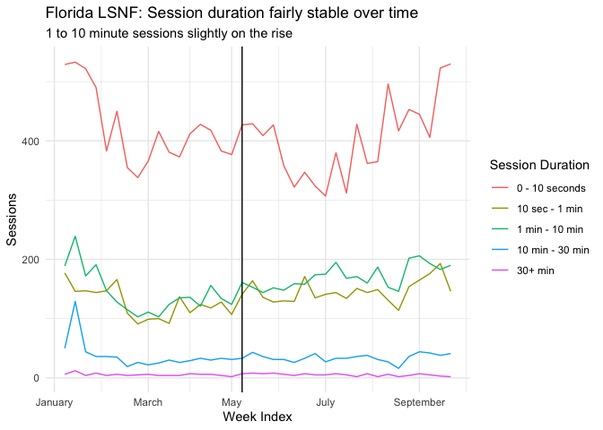

Florida LSNF Website Analysis
================
Julia Park
2020-11-23

  - [Visitors](#visitors)
  - [Traffic Type](#traffic-type)
  - [Duration](#duration)
  - [Search Performance](#search-performance)
      - [Search Check:](#search-check)
      - [Recommendations](#recommendations)

## Visitors

<!-- -->

## Traffic Type

<!-- -->

<!-- -->

## Duration

<!-- -->

<!-- -->

# Search Performance

<!-- -->

<!-- -->

<!-- -->

## Search Check:

    ## # A tibble: 1 x 1
    ##   total_direct_search_clicks
    ##                        <dbl>
    ## 1                       2132

    ## [1] 6274

    ##   total_direct_search_clicks
    ## 1                  0.3398151

## Recommendations

Pages with high Click rate, but low CTR:

    ## # A tibble: 5 x 3
    ##   `Landing Page`                   CTR Clicks
    ##   <chr>                          <dbl>  <dbl>
    ## 1 /staff-positions-internships/ 0.0099    359
    ## 2 /fl-veterans-legal-helpline/  0.0139    176
    ## 3 /lsnf-staff/                  0.0159    509
    ## 4 /contact/                     0.0188    694
    ## 5 /                             0.0276   3155

Highest CTR:

    ## # A tibble: 5 x 2
    ##   `Landing Page`                   CTR
    ##   <chr>                          <dbl>
    ## 1 /                             0.0276
    ## 2 /contact/                     0.0188
    ## 3 /lsnf-staff/                  0.0159
    ## 4 /fl-veterans-legal-helpline/  0.0139
    ## 5 /staff-positions-internships/ 0.0099

Highest Impression count:

    ## # A tibble: 5 x 2
    ##   `Landing Page`                Impressions
    ##   <chr>                               <dbl>
    ## 1 /                                  114497
    ## 2 /contact/                           36961
    ## 3 /staff-positions-internships/       36181
    ## 4 /hurricane-michael/                 35394
    ## 5 /lsnf-staff/                        31928

Highest Page-per-session count:

    ## # A tibble: 5 x 2
    ##   `Landing Page`                 `Pages / Session`
    ##   <chr>                                      <dbl>
    ## 1 /                                           2.84
    ## 2 /about-us/mission-and-purpose/              2.48
    ## 3 /services-overview/                         2.35
    ## 4 /clinics-hotline/                           1.86
    ## 5 /staff-positions-internships/               1.73

    ## # A tibble: 5 x 2
    ##   `Landing Page`                Clicks
    ##   <chr>                          <dbl>
    ## 1 /                               3155
    ## 2 /contact/                        694
    ## 3 /lsnf-staff/                     509
    ## 4 /staff-positions-internships/    359
    ## 5 /fl-veterans-legal-helpline/     176
