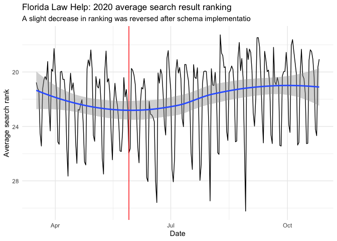

Florida Law Help Website Analysis
================
Julia Park
2020-11-23

  - [Visitors](#visitors)
  - [Queries](#queries)
  - [Recommendation](#recommendation)

## Visitors

<!-- -->

<!-- -->

<!-- -->

## Queries

<!-- -->

Queries with the highest click-through rates:

    ## # A tibble: 5 x 5
    ##   Query                                          CTR Clicks Impressions Position
    ##   <chr>                                        <dbl>  <dbl>       <dbl>    <dbl>
    ## 1 steps to get divorce in florida              0.588     10          17     1.06
    ## 2 what is medically needy share of cost in fl… 0.471     16          34     1   
    ## 3 florida medicare savings program eligibility 0.458     11          24     1   
    ## 4 florida divorce steps                        0.449     40          89     1   
    ## 5 divorce in florida steps                     0.444     16          36     1

Queries where Law Help is in the first position:

    ## # A tibble: 16 x 5
    ##    Query                                      Position Clicks Impressions    CTR
    ##    <chr>                                         <dbl>  <dbl>       <dbl>  <dbl>
    ##  1 florida law help                                  1    287         798 0.360 
    ##  2 floridalawhelp                                    1     85         220 0.386 
    ##  3 how much to file for divorce in florida           1     70         862 0.0812
    ##  4 florida legal help                                1     58         257 0.226 
    ##  5 florida divorce filing fee                        1     49         430 0.114 
    ##  6 florida divorce steps                             1     40          89 0.449 
    ##  7 simplified dissolution of marriage florid…        1     39         151 0.258 
    ##  8 qi1 medicaid florida                              1     38         112 0.339 
    ##  9 florida eviction notice requirements              1     30          94 0.319 
    ## 10 cost to file for divorce in florida               1     24         331 0.0725
    ## 11 simplified dissolution of marriage, flori…        1     21         111 0.189 
    ## 12 unlawful detainer vs ejectment florida            1     17          68 0.25  
    ## 13 divorce in florida steps                          1     16          36 0.444 
    ## 14 what is medically needy share of cost in …        1     16          34 0.471 
    ## 15 how much is a simple divorce in florida           1     15         215 0.0698
    ## 16 florida medicare savings program eligibil…        1     11          24 0.458

## Recommendation

Pages with high traffic (many clicks), but low click-through rate:

    ## # A tibble: 20 x 5
    ##    Page                                       Clicks Impressions    CTR Position
    ##    <chr>                                       <dbl>       <dbl>  <dbl>    <dbl>
    ##  1 https://www.floridalawhelp.org/content/wh…   2367       90652 0.0261     26.0
    ##  2 https://www.floridalawhelp.org/content/st…  13997      486094 0.0288     18.6
    ##  3 https://www.floridalawhelp.org/content/si…   9139      297946 0.0307     15.0
    ##  4 https://www.floridalawhelp.org/content/he…   7535      231949 0.0325     26.2
    ##  5 https://www.floridalawhelp.org/content/go…   3269       99611 0.0328     11.1
    ##  6 https://www.floridalawhelp.org/content/me…   3056       89361 0.0342     32.5
    ##  7 https://www.floridalawhelp.org/content/FA…   2193       58803 0.0373     26.1
    ##  8 https://www.floridalawhelp.org/content/wh…   4078      101957 0.04       19.6
    ##  9 https://www.floridalawhelp.org/content/fi…   6994      168926 0.0414     18  
    ## 10 https://www.floridalawhelp.org/content/fo…   8895      201791 0.0441     23.1
    ## 11 https://www.floridalawhelp.org/content/do…  14572      318646 0.0457     18.8
    ## 12 https://www.floridalawhelp.org/content/se…   8285      180693 0.0459     16.9
    ## 13 https://www.floridalawhelp.org/content/se…  11490      224915 0.0511     18.9
    ## 14 https://www.floridalawhelp.org/content/il…   4533       88326 0.0513     18.1
    ## 15 https://www.floridalawhelp.org/content/wa…   4388       85544 0.0513     16.6
    ## 16 https://www.floridalawhelp.org/content/Ev…  38445      728912 0.0527     14.9
    ## 17 https://www.floridalawhelp.org/content/yo…  15036      246342 0.061      16.7
    ## 18 https://www.floridalawhelp.org/content/Ca…  11863      186489 0.0636     14.5
    ## 19 https://www.floridalawhelp.org/content/me…  12502      181652 0.0688     20.0
    ## 20 https://www.floridalawhelp.org/content/wh…   7747       99416 0.0779     11.1
