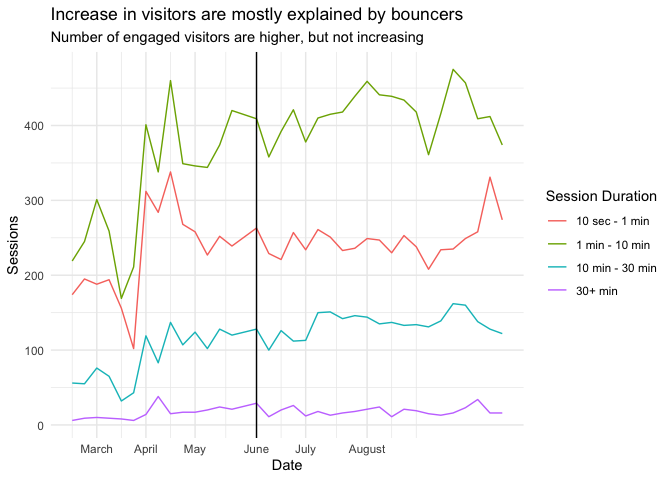

Hawaii
================
Julia Park
2020-10-29

  - [Visitors](#visitors)
  - [Duration](#duration)

``` r
# Libraries
library(tidyverse)
library(readxl)
library(lubridate)

# Parameters
# change this to your directory
setwd("~/GitHub/Lab_Legal_Design/schema_eval/data")

file_daily_visitors = "Hawaii/visitors-daily-count.xlsx"
file_weekly_visitors = "Hawaii/visitors-overview-total.xlsx"
file_engagement_depth = "Hawaii/visitors-engagement-depth.xlsx"
file_freq_interval = "Hawaii/visitors-frequency-recency-interval.xlsx"
file_freq_session_count = "Hawaii/visitors-frequency-recency-session-count.xlsx"

#multi vs single
file_session_type = "Hawaii/visitors-overview-session-type.xlsx" 

#direct vs search vs organic
file_traffic_type_2019 = "Hawaii/visitors-overview-traffic-type-2019.xlsx"
file_traffic_type_2020 = "Hawaii/visitors-overview-traffic-type-2020.xlsx"

file_engagement_duration_timeseries = "Hawaii/visitors-duration-timeseries.rds"

file_landing_pages = "Hawaii/acquisition-sc-landingpages.xlsx"
file_queries = "Hawaii/acquisition-sc-queries.xlsx"

#===============================================================================

# Code
schema_week <- 15 # 6/2/2020
string_2019 <- "Jan 1, 2019 - Oct 27, 2019"
string_2020 <- "Jan 1, 2020 - Oct 27, 2020"
daily_visitors_2020 <- read_excel(file_daily_visitors, sheet = "Dataset1") %>% filter(`Date Range` == string_2020)
weekly_visitors <- read_excel(file_weekly_visitors, sheet = "Dataset1")
engagement_depth <- read_excel(file_engagement_depth)
freq_interval <- read_excel(file_freq_interval, skip = 6)
freq_session_count <- read_excel(file_freq_session_count, skip = 6)
session_type <- read_excel(file_session_type)
traffic_type_2019 <- read_excel(file_traffic_type_2019, skip = 6)
traffic_type_2020 <- read_excel(file_traffic_type_2020, skip = 6)
landing_pages <- read_excel(file_landing_pages, skip = 6)
queries <- read_excel(file_queries, skip = 6)

engagement_duration_timeseries <- read_rds(file_engagement_duration_timeseries)
session_type_timeseries <- session_type
```

## Visitors

``` r
daily_visitors_2020 %>% 
 drop_na() %>% 
 ggplot(aes(x = `Day Index`, y = Users)) +
 geom_line() + 
 geom_vline(xintercept = as.POSIXct(as.Date("2020-06-02")), color = "red") + 
 geom_smooth(method = "loess") +
 labs(
  title = "2020 daily visitors: Trend only roughly follows average visitor trend for this year", 
  subtitle = "Dip in March, increase in May, but continued increase into August",
  x = "Date"
 ) + 
 theme_minimal()
```

<!-- -->

``` r
x_labels_march <- function(x) {
 case_when(
  x == 2 ~ "March", 
  x == 6 ~ "April", 
  x == 10 ~ "May", 
  x == 15 ~ "June", 
  x == 19 ~ "July",
  x == 24 ~ "August",
 )
}

x_breaks_march <- c(2, 6, 10, 15, 19, 24)

x_labels <- function(x) {
 case_when(
  x == 0 ~ "January", 
  x == 9 ~ "March", 
  x == 17 ~ "May", 
  x == 26 ~ "July", 
 )
}

x_breaks <- c(0, 9, 17, 26)
```

``` r
weekly_visitors %>% 
  filter(Users != 0) %>% 
  filter(`Week Index` != 43) %>% 
  drop_na() %>% 
  ggplot(aes(x = `Week Index`, y = Users, color = `Date Range`)) +
  geom_vline(aes(xintercept = 22)) +
  geom_smooth() + 
  geom_line() + 
  scale_x_continuous(
    breaks = x_breaks, 
    labels = x_labels
  ) +
  labs(
    title = "Visitor count increases after schema implementation", 
    subtitle = "However, visitor count already increasing, 2019/2020 very different", 
    x = "Date"
  ) + 
  theme_minimal()
```

    ## `geom_smooth()` using method = 'loess' and formula 'y ~ x'

<!-- -->

## Duration

``` r
new_engagement_duration_timeseries <-
 engagement_duration_timeseries %>% 
 mutate(
  `Session Duration` = fct_collapse(`Session Duration`, 
     `0 - 10 seconds` = c("0-10 seconds"), 
     `10 sec - 1 min` = c("11-30 seconds", "31-60 seconds"),
     `1 min - 10 min` = c("61-180 seconds", "181-600 seconds"), 
     `10 min - 30 min` = c("601-1800 seconds"), 
     `30+ min` = c("1801+ seconds")
   ), 
  `Session Duration` = fct_relevel(`Session Duration`, "0 - 10 seconds", "10 sec - 1 min", "1 min - 10 min", "10 min - 30 min", "30+ min")
 ) %>% 
 group_by(`Session Duration`, week_index) %>% 
 summarize(
  Sessions = sum(Sessions), 
  Pageviews = sum(Pageviews)
 ) %>% 
 ungroup() %>% 
 filter(`Session Duration` != "Total")
```

``` r
new_engagement_duration_timeseries %>% 
  filter(`Session Duration` != "Total") %>% 
  ggplot(aes(x = week_index, y = Sessions, color = `Session Duration`)) + 
  geom_line() + 
  geom_vline(xintercept = 15) + 
  scale_x_continuous(
   labels = x_labels_march, 
   breaks = x_breaks_march
  ) +
  labs(
   title = "Increase in visitors are mostly explained by bouncers", 
   subtitle = "Number of engaged visitors are higher, but not increasing",
   x = "Date"
  ) +
  theme_minimal() 
```

<!-- -->

``` r
new_engagement_duration_timeseries %>% 
  filter(`Session Duration` != "Total") %>% 
  filter(`Session Duration` != "0 - 10 seconds") %>% 
  ggplot(aes(x = week_index, y = Sessions, color = `Session Duration`)) + 
  geom_line() + 
  geom_vline(xintercept = 15) + 
  scale_x_continuous(
   labels = x_labels_march, 
   breaks = x_breaks_march
  ) +
  labs(
   title = "Increase in visitors are mostly explained by bouncers", 
   subtitle = "Number of engaged visitors are higher, but not increasing",
   x = "Date"
  ) +
  theme_minimal() 
```

<!-- -->

``` r
new_engagement_duration_timeseries %>% 
  filter(`Session Duration` != "Total") %>% 
  ggplot(aes(x = week_index, y = Pageviews, color = `Session Duration`)) + 
  geom_line() + 
  geom_vline(xintercept = 15) + 
  scale_x_continuous(
   labels = x_labels_march, 
   breaks = x_breaks_march
  ) +
  labs(
   title = "Pageviews suddenly increased in April and then decreased", 
   x = "Date", 
   y = "Pageviews"
  ) +
  theme_minimal()
```

<!-- -->

``` r
new_engagement_duration_timeseries %>% 
  mutate(
    pageview_per_session = Pageviews / Sessions
  ) %>% 
  filter(`Session Duration` != "Total") %>% 
  ggplot(aes(x = week_index, y = pageview_per_session, color = `Session Duration`)) + 
  geom_line() + 
  geom_vline(xintercept = 15) + 
  scale_x_continuous(
   labels = x_labels_march, 
   breaks = x_breaks_march
  ) +
  labs(
   title = "Pageview per session shows no indication of schema effectiveness", 
   subtitle = "Inexplainable sudden decrease at beginning of May",
   x = "Date", 
   y = "Pageview per session"
  ) +
  theme_minimal()
```

<!-- -->
