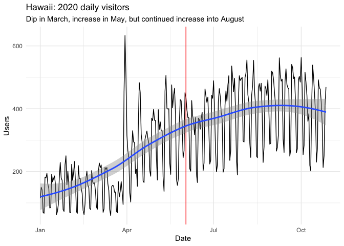
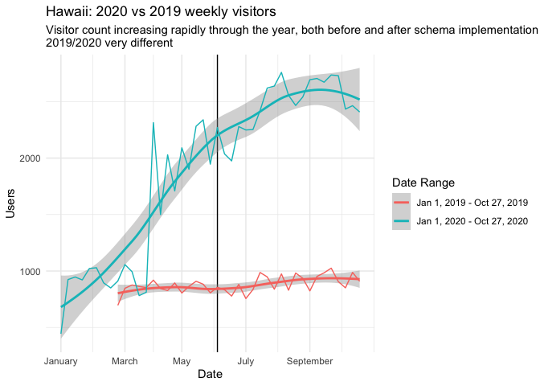
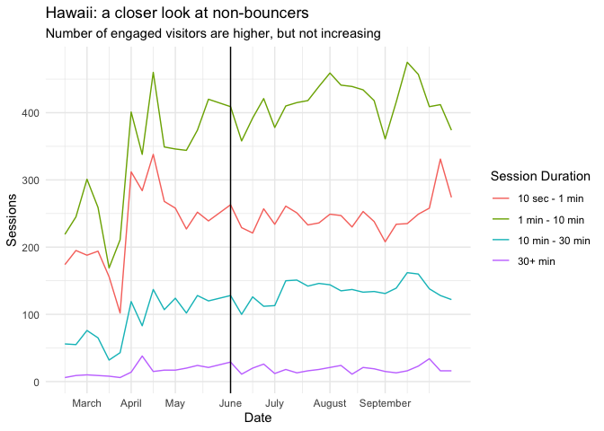

Hawaii
================
Julia Park
2020-11-23

  - [Visitors](#visitors)
  - [Traffic Type](#traffic-type)
  - [Duration](#duration)
  - [Search check](#search-check)
  - [Solution](#solution)

## Visitors

<!-- -->

<!-- -->

## Traffic Type

<!-- -->

<!-- -->

## Duration

<!-- -->

<!-- -->

<!-- -->

<!-- -->

## Search check

    ## # A tibble: 1 x 1
    ##   total
    ##   <dbl>
    ## 1 15050

    ## # A tibble: 1 x 1
    ##   total_direct_search_clicks
    ##                        <dbl>
    ## 1                       2193

    ##   total_direct_search_clicks
    ## 1                   0.179872

## Solution

Increase in bouncers not *because* of schema, since it was happening
before the implementation - likely many people searching for legal aid
because of shutdown and not finding what they were looking for.

However, the lack of increase in engaged viewers may be due to incorrect
schema?
