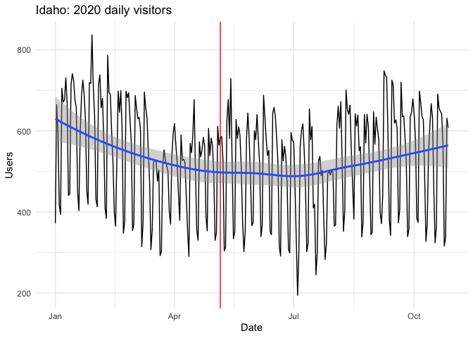
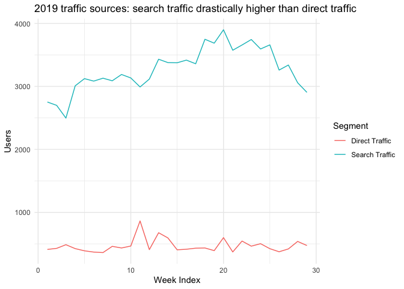
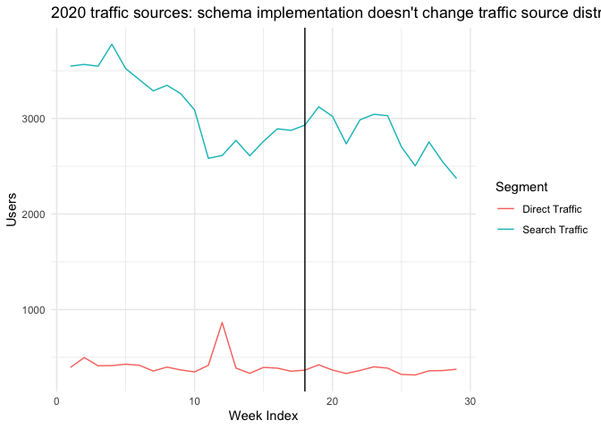

Idaho Legal Aid Website Analysis
================
Julia Park
2020-11-23

  - [Visitors](#visitors)
  - [Traffic](#traffic)
  - [Duration](#duration)
  - [Search Result Performance](#search-result-performance)
  - [Comparison](#comparison)
  - [Recommendations](#recommendations)

## Visitors

<!-- -->

<!-- -->

## Traffic

<!-- -->

<!-- -->

## Duration

<!-- -->

<!-- -->

## Search Result Performance

<!-- -->

<!-- -->

## Comparison

    ## # A tibble: 1 x 1
    ##   total_direct_search_clicks
    ##                        <dbl>
    ## 1                       4951

    ## [1] 109547

    ##   total_direct_search_clicks
    ## 1                 0.04519521

## Recommendations

Pages with high Click rate, but low CTR:

    ## # A tibble: 6 x 12
    ##   `Landing Page`    CTR Clicks `Date Range` Impressions `Average Positi…
    ##   <chr>           <dbl>  <dbl> <chr>              <dbl>            <dbl>
    ## 1 /node/1272/ss… 0.0038   1451 Jan 1, 2020…      378812               49
    ## 2 /              0.016    5575 Jan 1, 2020…      349325               46
    ## 3 /node/2207/se… 0.0242   2887 Jan 1, 2020…      119101               31
    ## 4 /node/2452/12… 0.0243  40680 Jan 1, 2020…     1672929               21
    ## 5 /files/Tenant… 0.0375   3772 Jan 1, 2020…      100600               33
    ## 6 /node/1259/wh… 0.0504   4728 Jan 1, 2020…       93835               25
    ## # … with 6 more variables: Sessions <dbl>, `Bounce Rate` <dbl>, `Pages /
    ## #   Session` <dbl>, `Goal Completions` <dbl>, `Goal Value` <dbl>, `Goal
    ## #   Conversion Rate` <dbl>

Highest CTR:

    ## # A tibble: 5 x 12
    ##   `Landing Page`    CTR `Date Range` Impressions Clicks `Average Positi…
    ##   <chr>           <dbl> <chr>              <dbl>  <dbl>            <dbl>
    ## 1 /node/1259/wh… 0.0504 Jan 1, 2020…       93835   4728               25
    ## 2 /files/Tenant… 0.0375 Jan 1, 2020…      100600   3772               33
    ## 3 /node/2452/12… 0.0243 Jan 1, 2020…     1672929  40680               21
    ## 4 /node/2207/se… 0.0242 Jan 1, 2020…      119101   2887               31
    ## 5 /              0.016  Jan 1, 2020…      349325   5575               46
    ## # … with 6 more variables: Sessions <dbl>, `Bounce Rate` <dbl>, `Pages /
    ## #   Session` <dbl>, `Goal Completions` <dbl>, `Goal Value` <dbl>, `Goal
    ## #   Conversion Rate` <dbl>

Highest Impression count:

    ## # A tibble: 5 x 12
    ##   `Landing Page` Impressions `Date Range` Clicks    CTR `Average Positi…
    ##   <chr>                <dbl> <chr>         <dbl>  <dbl>            <dbl>
    ## 1 /node/2452/12…     1672929 Jan 1, 2020…  40680 0.0243             21  
    ## 2 /node/1272/ss…      378812 Jan 1, 2020…   1451 0.0038             49  
    ## 3 /                   349325 Jan 1, 2020…   5575 0.016              46  
    ## 4 /files/ChildS…      175036 Jan 1, 2020…    788 0.0045             11  
    ## 5 /node/1262/id…      173083 Jan 1, 2020…    304 0.0018              9.1
    ## # … with 6 more variables: Sessions <dbl>, `Bounce Rate` <dbl>, `Pages /
    ## #   Session` <dbl>, `Goal Completions` <dbl>, `Goal Value` <dbl>, `Goal
    ## #   Conversion Rate` <dbl>

Highest Page-per-session count:

    ## # A tibble: 5 x 12
    ##   `Landing Page` `Pages / Sessio… `Date Range` Impressions Clicks    CTR
    ##   <chr>                     <dbl> <chr>              <dbl>  <dbl>  <dbl>
    ## 1 /node/2207/se…             3.72 Jan 1, 2020…      119101   2887 0.0242
    ## 2 /topics/2027/…             3.12 Jan 1, 2020…      115511    432 0.0037
    ## 3 /node/1262/id…             1.53 Jan 1, 2020…      173083    304 0.0018
    ## 4 /node/1272/ss…             1.29 Jan 1, 2020…      378812   1451 0.0038
    ## 5 /node/1259/wh…             1.25 Jan 1, 2020…       93835   4728 0.0504
    ## # … with 6 more variables: `Average Position` <dbl>, Sessions <dbl>, `Bounce
    ## #   Rate` <dbl>, `Goal Completions` <dbl>, `Goal Value` <dbl>, `Goal Conversion
    ## #   Rate` <dbl>

Highest click count:

    ## # A tibble: 5 x 12
    ##   `Landing Page` Clicks `Date Range` Impressions    CTR `Average Positi…
    ##   <chr>           <dbl> <chr>              <dbl>  <dbl>            <dbl>
    ## 1 /node/2452/12…  40680 Jan 1, 2020…     1672929 0.0243               21
    ## 2 /                5575 Jan 1, 2020…      349325 0.016                46
    ## 3 /node/1259/wh…   4728 Jan 1, 2020…       93835 0.0504               25
    ## 4 /files/Tenant…   3772 Jan 1, 2020…      100600 0.0375               33
    ## 5 /node/2207/se…   2887 Jan 1, 2020…      119101 0.0242               31
    ## # … with 6 more variables: Sessions <dbl>, `Bounce Rate` <dbl>, `Pages /
    ## #   Session` <dbl>, `Goal Completions` <dbl>, `Goal Value` <dbl>, `Goal
    ## #   Conversion Rate` <dbl>
