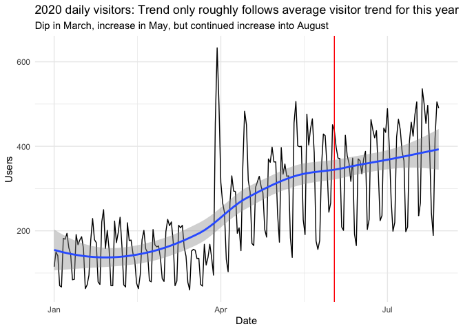
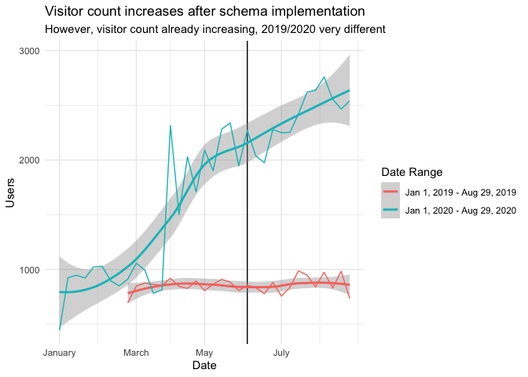
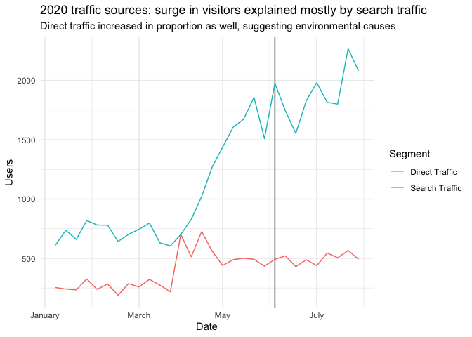
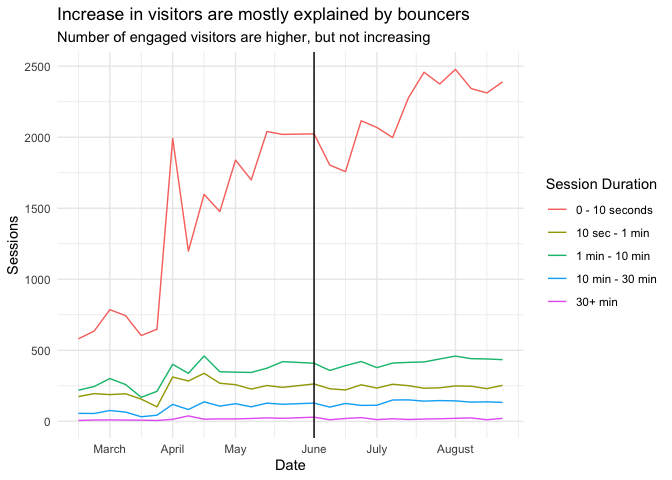
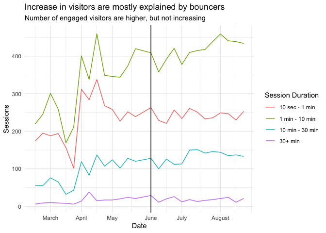
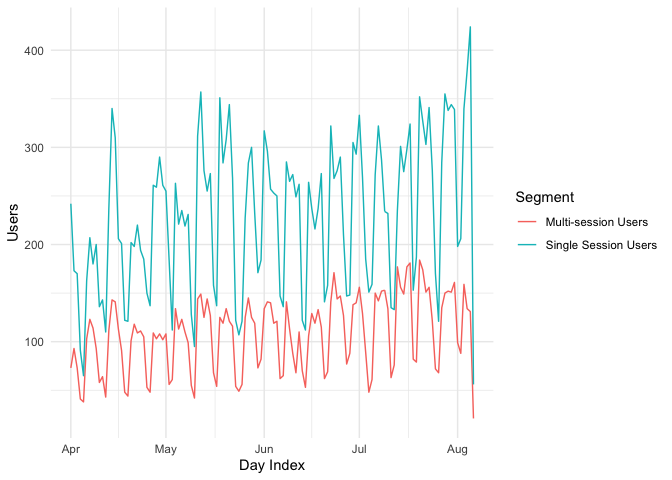
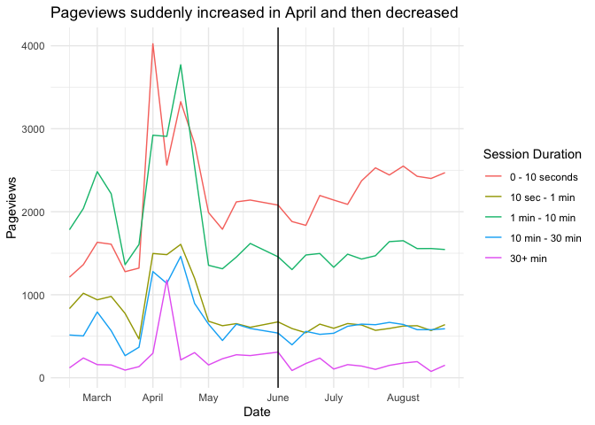
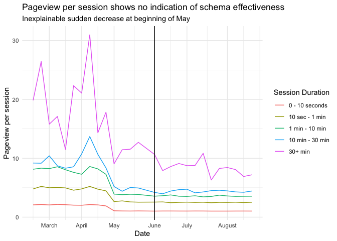

Hawaii
================
Julia Park
2020-10-28

  - [Visitors](#visitors)
  - [Duration](#duration)
  - [Search check](#search-check)
  - [Solution](#solution)

``` r
# Libraries
library(tidyverse)
library(readxl)
library(lubridate)

# Parameters
# change this to your directory
setwd("~/GitHub/Lab_Legal_Design/schema_eval/data")

file_visitors = "Hawaii/acquisition-sc-clicks.xlsx"
file_engagement_depth = "Hawaii/visitors-engagement-depth.xlsx"
file_freq_interval = "Hawaii/visitors-frequency-recency-interval.xlsx"
file_freq_session_count = "Hawaii/visitors-frequency-recency-session-count.xlsx"

#multi vs single
file_session_type = "Hawaii/visitors-overview-session-type.xlsx" 

#direct vs search vs organic
file_traffic_type_2019 = "Hawaii/visitors-overview-traffic-type-2019.xlsx"
file_traffic_type_2020 = "Hawaii/visitors-overview-traffic-type-2020.xlsx"

file_engagement_duration_timeseries = "Hawaii/visitors-duration-timeseries.rds"

file_landing_pages = "Hawaii/acquisition-sc-landingpages.xlsx"
file_queries = "Hawaii/acquisition-sc-queries.xlsx"

#===============================================================================

# Code
schema_week <- 15 # 6/2/2020
daily_visitors_2019 <- read_excel(file_visitors, sheet = "Day_2019")
daily_visitors_2020 <- read_excel(file_visitors, sheet = "Day_2020")
weekly_visitors <- read_excel(file_visitors, sheet = "Week")
engagement_depth <- read_excel(file_engagement_depth)
freq_interval <- read_excel(file_freq_interval, skip = 6)
freq_session_count <- read_excel(file_freq_session_count, skip = 6)
session_type <- read_excel(file_session_type)
traffic_type_2019 <- read_excel(file_traffic_type_2019, skip = 6)
traffic_type_2020 <- read_excel(file_traffic_type_2020, skip = 6)
landing_pages <- read_excel(file_landing_pages, skip = 6)
queries <- read_excel(file_queries, skip = 6)

engagement_duration_timeseries <- read_rds(file_engagement_duration_timeseries)
session_type_timeseries <- session_type
```

## Visitors

``` r
daily_visitors_2020 %>% 
 drop_na() %>% 
 ggplot(aes(x = `Day Index`, y = Users)) +
 geom_line() + 
 geom_vline(xintercept = as.POSIXct(as.Date("2020-06-02")), color = "red") + 
 geom_smooth(method = "loess") +
 labs(
  title = "2020 daily visitors: Trend only roughly follows average visitor trend for this year", 
  subtitle = "Dip in March, increase in May, but continued increase into August",
  x = "Date"
 ) + 
 theme_minimal()
```

<!-- -->

``` r
x_labels_march <- function(x) {
 case_when(
  x == 2 ~ "March", 
  x == 6 ~ "April", 
  x == 10 ~ "May", 
  x == 15 ~ "June", 
  x == 19 ~ "July",
  x == 24 ~ "August",
 )
}

x_breaks_march <- c(2, 6, 10, 15, 19, 24)

x_labels <- function(x) {
 case_when(
  x == 0 ~ "January", 
  x == 9 ~ "March", 
  x == 17 ~ "May", 
  x == 26 ~ "July", 
 )
}

x_breaks <- c(0, 9, 17, 26)

weekly_visitors %>% 
 filter(Users != 0) %>% 
 ggplot(aes(x = `Week Index`, y = Users, color = `Date Range`)) +
 geom_vline(aes(xintercept = 22)) +
 geom_smooth() + 
 geom_line() + 
 scale_x_continuous(
  breaks = x_breaks, 
  labels = x_labels
 ) +
 labs(
  title = "Visitor count increases after schema implementation", 
  subtitle = "However, visitor count already increasing, 2019/2020 very different", 
  x = "Date"
 ) + 
 theme_minimal()
```

    ## `geom_smooth()` using method = 'loess' and formula 'y ~ x'

<!-- -->

``` r
traffic_type_2019 %>% 
  drop_na() %>% 
  filter(Users != 0) %>% 
  mutate(
    week_index = week(`Day Index`)
  ) %>% 
  filter(week_index != 8) %>% 
  group_by(week_index, Segment) %>% 
  summarize(
    Users = sum(Users)
  ) %>% 
  ungroup() %>% 
  filter(Segment != "All Users") %>% 
  filter(Segment != "Organic Traffic") %>% 
  ggplot(aes(x = week_index, y = Users, color = Segment)) +
  geom_line() + 
  scale_x_continuous(
   breaks = x_breaks, 
   labels = x_labels
  ) +
  labs(
    title = "2019 traffic sources: traffic source proportions are consistent",
    subtitle = "search traffic much higher than direct traffic", 
    x = "Date"
  ) + 
  theme_minimal()
```

<!-- -->

``` r
traffic_type_2020 %>% 
  drop_na() %>% 
  mutate(
    week_index = week(`Day Index`)
  ) %>% 
  filter(week_index != 31) %>% 
  group_by(week_index, Segment) %>% 
  summarize(
    Users = sum(Users)
  ) %>% 
  ungroup() %>% 
  filter(Segment != "All Users") %>% 
  filter(Segment != "Organic Traffic") %>% 
  ggplot(aes(x = week_index, y = Users, color = Segment)) +
  geom_vline(aes(xintercept = 22)) + 
  geom_line() + 
  scale_x_continuous(
   breaks = x_breaks, 
   labels = x_labels
  ) +
  labs(
    title = "2020 traffic sources: surge in visitors explained mostly by search traffic", 
    subtitle = "Direct traffic increased in proportion as well, suggesting environmental causes",
    x = "Date"
  ) + 
  theme_minimal()
```

<!-- -->

## Duration

``` r
new_engagement_duration_timeseries <-
 engagement_duration_timeseries %>% 
 mutate(
  `Session Duration` = fct_collapse(`Session Duration`, 
     `0 - 10 seconds` = c("0-10 seconds"), 
     `10 sec - 1 min` = c("11-30 seconds", "31-60 seconds"),
     `1 min - 10 min` = c("61-180 seconds", "181-600 seconds"), 
     `10 min - 30 min` = c("601-1800 seconds"), 
     `30+ min` = c("1801+ seconds")
   ), 
  `Session Duration` = fct_relevel(`Session Duration`, "0 - 10 seconds", "10 sec - 1 min", "1 min - 10 min", "10 min - 30 min", "30+ min")
 ) %>% 
 group_by(`Session Duration`, week_index) %>% 
 summarize(
  Sessions = sum(Sessions), 
  Pageviews = sum(Pageviews)
 ) %>% 
 ungroup() %>% 
 filter(`Session Duration` != "Total")
```

``` r
new_engagement_duration_timeseries %>% 
  filter(`Session Duration` != "Total") %>% 
  ggplot(aes(x = week_index, y = Sessions, color = `Session Duration`)) + 
  geom_line() + 
  geom_vline(xintercept = 15) + 
  scale_x_continuous(
   labels = x_labels_march, 
   breaks = x_breaks_march
  ) +
  labs(
   title = "Increase in visitors are mostly explained by bouncers", 
   subtitle = "Number of engaged visitors are higher, but not increasing",
   x = "Date"
  ) +
  theme_minimal() 
```

<!-- -->

``` r
new_engagement_duration_timeseries %>% 
  filter(`Session Duration` != "Total") %>% 
  filter(`Session Duration` != "0 - 10 seconds") %>% 
  ggplot(aes(x = week_index, y = Sessions, color = `Session Duration`)) + 
  geom_line() + 
  geom_vline(xintercept = 15) + 
  scale_x_continuous(
   labels = x_labels_march, 
   breaks = x_breaks_march
  ) +
  labs(
   title = "Increase in visitors are mostly explained by bouncers", 
   subtitle = "Number of engaged visitors are higher, but not increasing",
   x = "Date"
  ) +
  theme_minimal() 
```

<!-- -->

``` r
session_type_timeseries %>% 
 filter(Year == 2020) %>% 
 filter(Segment != "All Users") %>% 
 ggplot(aes(x = `Day Index`, y = Users, color = Segment)) + 
 geom_line() + 
 theme_minimal()
```

<!-- -->

``` r
new_engagement_duration_timeseries %>% 
  filter(`Session Duration` != "Total") %>% 
  ggplot(aes(x = week_index, y = Pageviews, color = `Session Duration`)) + 
  geom_line() + 
  geom_vline(xintercept = 15) + 
  scale_x_continuous(
   labels = x_labels_march, 
   breaks = x_breaks_march
  ) +
  labs(
   title = "Pageviews suddenly increased in April and then decreased", 
   x = "Date", 
   y = "Pageviews"
  ) +
  theme_minimal()
```

<!-- -->

``` r
new_engagement_duration_timeseries %>% 
  mutate(
    pageview_per_session = Pageviews / Sessions
  ) %>% 
  filter(`Session Duration` != "Total") %>% 
  ggplot(aes(x = week_index, y = pageview_per_session, color = `Session Duration`)) + 
  geom_line() + 
  geom_vline(xintercept = 15) + 
  scale_x_continuous(
   labels = x_labels_march, 
   breaks = x_breaks_march
  ) +
  labs(
   title = "Pageview per session shows no indication of schema effectiveness", 
   subtitle = "Inexplainable sudden decrease at beginning of May",
   x = "Date", 
   y = "Pageview per session"
  ) +
  theme_minimal()
```

<!-- -->

## Search check

``` r
date_1 <- as.Date("2020-06-17")
date_2 <- as.Date("2020-08-02")

new_engagement_duration_timeseries %>% 
 filter(week_index > 16) %>% 
 filter(week_index < 24) %>% 
 filter(`Session Duration` == "0 - 10 seconds") %>% 
 summarize(
  total = sum(Sessions)
 )
```

    ## # A tibble: 1 x 1
    ##   total
    ##   <dbl>
    ## 1 15050

``` r
total_direct_search_clicks <- 
 queries %>% 
 filter(`Search Query` == "legal aid hawaii" || `Search Query` == "legal aid society of hawaii" || `Search Query` == "hawaii legal aid" || `Search Query` == "legal aid society") %>% 
 drop_na() %>% 
 summarize(
  total_direct_search_clicks = sum(Clicks)
 )

total_direct_search_clicks
```

    ## # A tibble: 1 x 1
    ##   total_direct_search_clicks
    ##                        <dbl>
    ## 1                       2193

``` r
direct_search_percentage <- total_direct_search_clicks / 12192

direct_search_percentage
```

    ##   total_direct_search_clicks
    ## 1                   0.179872

## Solution

Increase in bouncers not *because* of schema, since it was happening
before the implementation - likely many people searching for legal aid
because of shutdown and not finding what they were looking for.

However, the lack of increase in engaged viewers may be due to incorrect
schema?
