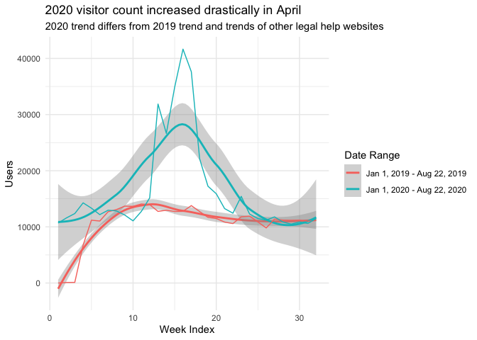
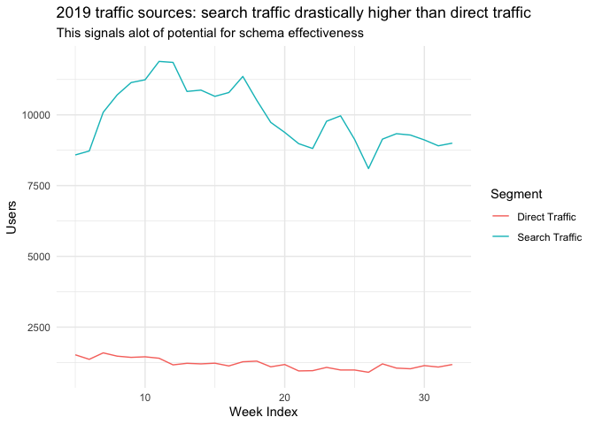
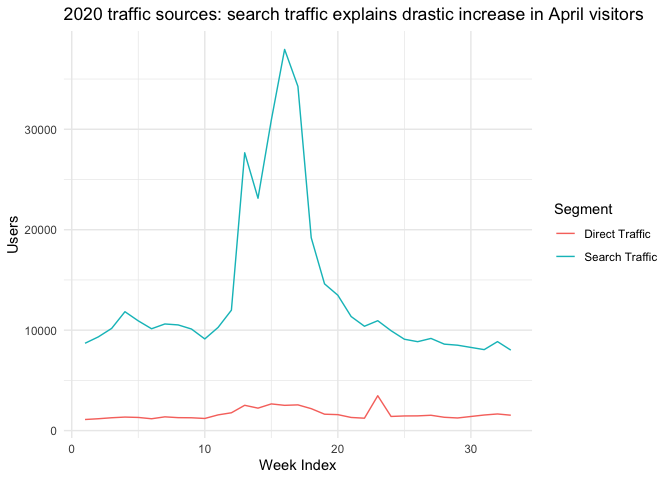
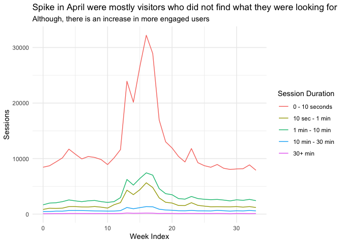
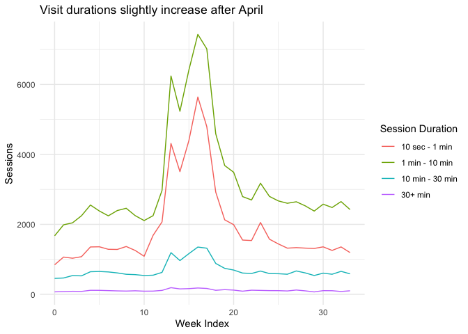
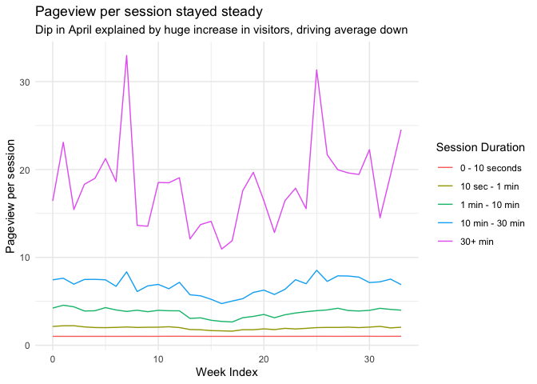

Minnesota
================
2020-10-28

  - [Landing pages](#landing-pages)
      - [Clicks](#clicks)
      - [Pages per session](#pages-per-session)
  - [Visitors](#visitors)
  - [Duration](#duration)

``` r
# Libraries
library(tidyverse)
library(readxl)

# Parameters
setwd("~/GitHub/Lab_Legal_Design/schema_eval/data")

file_landing_pages = "Minnesota/analytics-landing-pages.xlsx" 

file_weekly_visitors = "Minnesota/visitors-overview-total.xlsx"
file_engagement_depth = "Minnesota/visitors-engagement-depth.xlsx"
file_engagement_duration = "Minnesota/visitors-engagement-duration.xlsx"
file_freq_interval = "Minnesota/visitors-frequency-recency-interval.xlsx"
file_freq_session_count = "Minnesota/visitors-frequency-recency-session-count.xlsx"

#multi vs single
file_session_type = "Minnesota/visitors-overview-session-type.xlsx" 

#direct vs search vs organic
file_traffic_type = "Minnesota/visitors-overview-traffic-type.xlsx"

file_engagement_duration_timeseries = "Minnesota/visitors-duration-timeseries.rds"

#===============================================================================

# Code
string_2019 <- "Jan 1, 2019 - Aug 22, 2019"
string_2020 <- "Jan 1, 2020 - Aug 22, 2020"
landing_pages <- read_excel(file_landing_pages, sheet = "Dataset1") %>% drop_na()
daily_clicks <- read_excel(file_landing_pages, sheet = "Dataset2") %>% drop_na()

weekly_visitors <- read_excel(file_weekly_visitors)
engagement_depth <- read_excel(file_engagement_depth)
engagement_duration <- read_excel(file_engagement_duration)
freq_interval <- read_excel(file_freq_interval)
freq_session_count <- read_excel(file_freq_session_count)
session_type <- read_excel(file_session_type)
traffic_type <- read_excel(file_traffic_type)
engagement_duration_timeseries <- read_rds(file_engagement_duration_timeseries)
```

## Landing pages

### Clicks

Increase in April visits explained by COVID changes

``` r
landing_pages %>% 
  filter(Date == "Mar 1, 2020 - Apr 30, 2020") %>% 
  top_n(5, wt = Clicks) %>% 
  arrange(desc(Clicks))
```

    ## # A tibble: 5 x 12
    ##   `Landing Page` Date  Impressions Clicks   CTR `Average Positi… Sessions
    ##   <chr>          <chr>       <dbl>  <dbl> <dbl>            <dbl>    <dbl>
    ## 1 /self-help-li… Mar …      294181  40832 13.9              6.23    41482
    ## 2 /self-help-li… Mar …      367616  27767  7.55             7.77    28727
    ## 3 /self-help-li… Mar …     1301819  19028  1.46             7.50    18252
    ## 4 /self-help-li… Mar …      765905  11759  1.54            11.7      6695
    ## 5 /self-help-li… Mar …      630651  11429  1.81            16.1      6226
    ## # … with 5 more variables: `Bounce Rate` <dbl>, `Pages / Session` <dbl>,
    ## #   `Triage: Funnel 1 - Select topic (Goal 1 Completions)` <dbl>, `Triage:
    ## #   Funnel 1 - Select topic (Goal 1 Value)` <dbl>, `Triage: Funnel 1 - Select
    ## #   topic (Goal 1 Conversion Rate)` <dbl>

``` r
landing_pages %>% 
  filter(Date == "Jan 1, 2020 - Feb 29, 2020") %>% 
  top_n(5, wt = Clicks) %>% 
  arrange(desc(Clicks))
```

    ## # A tibble: 5 x 12
    ##   `Landing Page` Date  Impressions Clicks   CTR `Average Positi… Sessions
    ##   <chr>          <chr>       <dbl>  <dbl> <dbl>            <dbl>    <dbl>
    ## 1 /self-help-li… Jan …     1140068  21778  1.91             12.9        0
    ## 2 /self-help-li… Jan …      730781  11196  1.53             12.0        0
    ## 3 /self-help-li… Jan …      231683   5816  2.51             22.0        0
    ## 4 /self-help-li… Jan …      207738   5084  2.45             10.3        0
    ## 5 /self-help-li… Jan …      273161   4152  1.52             25.2        0
    ## # … with 5 more variables: `Bounce Rate` <dbl>, `Pages / Session` <dbl>,
    ## #   `Triage: Funnel 1 - Select topic (Goal 1 Completions)` <dbl>, `Triage:
    ## #   Funnel 1 - Select topic (Goal 1 Value)` <dbl>, `Triage: Funnel 1 - Select
    ## #   topic (Goal 1 Conversion Rate)` <dbl>

### Pages per session

The most engaged visitors are visiting general sites, which is a good
sign - exploring at a general site is natural.

``` r
landing_pages %>% 
 top_n(5, wt = `Pages / Session`) %>% 
 arrange(desc(`Pages / Session`))
```

    ## # A tibble: 5 x 12
    ##   `Landing Page` Date  Impressions Clicks   CTR `Average Positi… Sessions
    ##   <chr>          <chr>       <dbl>  <dbl> <dbl>            <dbl>    <dbl>
    ## 1 /self-help-li… Mar …        7957     43 0.540             7.98       53
    ## 2 /self-help-li… Mar …       11193     82 0.733            33.7        58
    ## 3 /              Mar …       35069   1189 3.39             28.2      1508
    ## 4 /lawhelpmn-gu… Mar …        7801     37 0.474             7.41      145
    ## 5 /self-help-li… Mar …        6498      9 0.139            42.8         3
    ## # … with 5 more variables: `Bounce Rate` <dbl>, `Pages / Session` <dbl>,
    ## #   `Triage: Funnel 1 - Select topic (Goal 1 Completions)` <dbl>, `Triage:
    ## #   Funnel 1 - Select topic (Goal 1 Value)` <dbl>, `Triage: Funnel 1 - Select
    ## #   topic (Goal 1 Conversion Rate)` <dbl>

## Visitors

``` r
weekly_visitors %>% 
 filter(`Week Index` != 33) %>% 
 filter(`Week Index` != 0) %>% 
 ggplot(aes(x = `Week Index`, y = Users, color = `Date Range`)) +
 geom_smooth() + 
 geom_line() + 
 labs(
  title = "2020 visitor count increased drastically in April", 
  subtitle = "2020 trend differs from 2019 trend and trends of other legal help websites"
 ) + 
 theme_minimal()
```

    ## `geom_smooth()` using method = 'loess' and formula 'y ~ x'

<!-- -->

``` r
traffic_type %>% 
  filter(`Date Range` == string_2019) %>% 
  filter(`Week Index` != 33) %>% 
  filter(`Week Index` > 4) %>% 
  filter(Segment != "All Users") %>% 
  filter(Segment != "Organic Traffic") %>% 
  ggplot(aes(x = `Week Index`, y = Users, color = Segment)) +
  geom_line() + 
  labs(
    title = "2019 traffic sources: search traffic drastically higher than direct traffic", 
    subtitle = "This signals alot of potential for schema effectiveness"
  ) + 
  theme_minimal()
```

<!-- -->

``` r
traffic_type %>% 
  filter(`Date Range` == string_2020) %>% 
  filter(`Week Index` != 0) %>% 
  filter(`Week Index` != 30) %>% 
  filter(Segment != "All Users") %>% 
  filter(Segment != "Organic Traffic") %>% 
  ggplot(aes(x = `Week Index`, y = Users, color = Segment)) +
  geom_line() + 
  labs(
    title = "2020 traffic sources: search traffic explains drastic increase in April visitors" 
  ) +
 theme_minimal()
```

<!-- -->

## Duration

``` r
new_engagement_duration_timeseries <-
 engagement_duration_timeseries %>% 
 mutate(
  `Session Duration` = fct_collapse(`Session Duration`, 
     `0 - 10 seconds` = c("0-10 seconds"), 
     `10 sec - 1 min` = c("11-30 seconds", "31-60 seconds"),
     `1 min - 10 min` = c("61-180 seconds", "181-600 seconds"), 
     `10 min - 30 min` = c("601-1800 seconds"), 
     `30+ min` = c("1801+ seconds")
   ), 
  `Session Duration` = fct_relevel(`Session Duration`, "0 - 10 seconds", "10 sec - 1 min", "1 min - 10 min", "10 min - 30 min", "30+ min")
 ) %>% 
 group_by(`Session Duration`, week_index) %>% 
 summarize(
  Sessions = sum(Sessions), 
  Pageviews = sum(Pageviews)
 ) %>% 
 ungroup() %>% 
 filter(`Session Duration` != "Total")
```

``` r
new_engagement_duration_timeseries %>% 
  filter(`Session Duration` != "Total") %>% 
  ggplot(aes(x = week_index, y = Sessions, color = `Session Duration`)) + 
  geom_line() + 
  labs(
   title = "Spike in April were mostly visitors who did not find what they were looking for", 
   subtitle = "Although, there is an increase in more engaged users",
   x = "Week Index"
  ) +
  theme_minimal() 
```

<!-- -->

``` r
new_engagement_duration_timeseries %>% 
  filter(`Session Duration` != "Total") %>% 
  filter(`Session Duration` != "0 - 10 seconds") %>% 
  ggplot(aes(x = week_index, y = Sessions, color = `Session Duration`)) + 
  geom_line() + 
  labs(
   title = "Visit durations slightly increase after April", 
   x = "Week Index"
  ) +
  theme_minimal() 
```

<!-- -->

``` r
new_engagement_duration_timeseries %>% 
  mutate(
    pageview_per_session = Pageviews / Sessions
  ) %>% 
  filter(`Session Duration` != "Total") %>% 
  ggplot(aes(x = week_index, y = pageview_per_session, color = `Session Duration`)) + 
  geom_line() + 
  labs(
   title = "Pageview per session stayed steady", 
   subtitle = "Dip in April explained by huge increase in visitors, driving average down",
   x = "Week Index", 
   y = "Pageview per session"
  ) +
  theme_minimal()
```

<!-- -->
