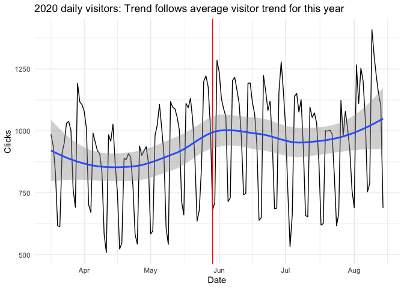
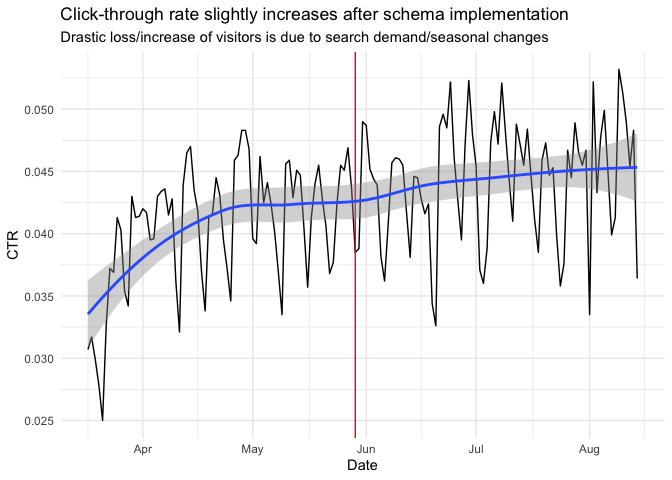
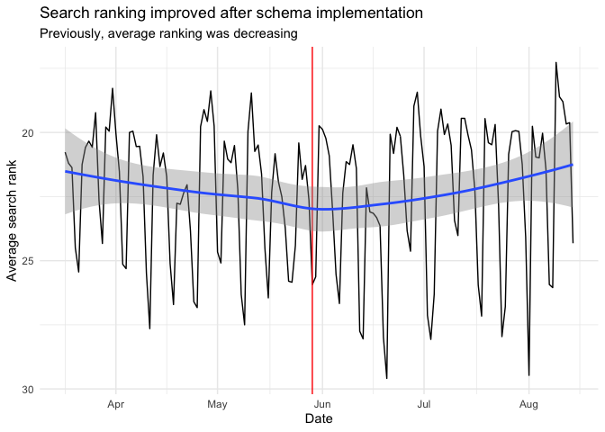
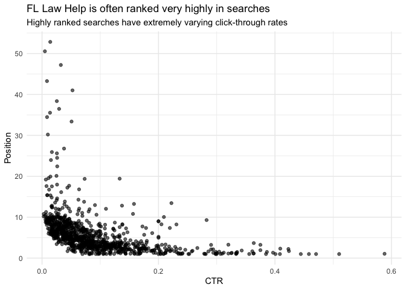

Florida Law Help Website Analysis
================
Julia Park
2020-10-28

  - [Problems with Analytics](#problems-with-analytics)
  - [Visitors](#visitors)
  - [Queries](#queries)
  - [Recommendation](#recommendation)

## Problems with Analytics

    ## # A tibble: 15 x 4
    ##    `Week Index` `Date Range`               Segment   Users
    ##           <dbl> <chr>                      <chr>     <dbl>
    ##  1           18 Apr 1, 2020 - Aug 16, 2020 All Users     4
    ##  2           19 Apr 1, 2020 - Aug 16, 2020 All Users     4
    ##  3           20 Apr 1, 2020 - Aug 16, 2020 All Users     0
    ##  4           21 Apr 1, 2020 - Aug 16, 2020 All Users     0
    ##  5           22 Apr 1, 2020 - Aug 16, 2020 All Users     0
    ##  6           23 Apr 1, 2020 - Aug 16, 2020 All Users     0
    ##  7           24 Apr 1, 2020 - Aug 16, 2020 All Users     0
    ##  8           25 Apr 1, 2020 - Aug 16, 2020 All Users     0
    ##  9           26 Apr 1, 2020 - Aug 16, 2020 All Users     0
    ## 10           27 Apr 1, 2020 - Aug 16, 2020 All Users     0
    ## 11           28 Apr 1, 2020 - Aug 16, 2020 All Users     0
    ## 12           29 Apr 1, 2020 - Aug 16, 2020 All Users     0
    ## 13           30 Apr 1, 2020 - Aug 16, 2020 All Users     0
    ## 14           31 Apr 1, 2020 - Aug 16, 2020 All Users     0
    ## 15           32 Apr 1, 2020 - Aug 16, 2020 All Users     0

## Visitors

<!-- -->

<!-- -->

<!-- -->

## Queries

<!-- -->

Queries with the highest click-through rates:

    ## # A tibble: 5 x 5
    ##   Query                                          CTR Clicks Impressions Position
    ##   <chr>                                        <dbl>  <dbl>       <dbl>    <dbl>
    ## 1 steps to get divorce in florida              0.588     10          17     1.06
    ## 2 florida divorce steps                        0.510     25          49     1   
    ## 3 what is medically needy share of cost in fl… 0.471     16          34     1   
    ## 4 florida medicare savings program eligibility 0.458     11          24     1   
    ## 5 divorce in florida steps                     0.444     16          36     1

Queries where Law Help is in the first position:

    ## # A tibble: 20 x 5
    ##    Query                                      Position Clicks Impressions    CTR
    ##    <chr>                                         <dbl>  <dbl>       <dbl>  <dbl>
    ##  1 florida law help                                  1    200         499 0.401 
    ##  2 floridalawhelp                                    1     58         142 0.408 
    ##  3 how much to file for divorce in florida           1     43         533 0.0807
    ##  4 florida divorce filing fee                        1     32         273 0.117 
    ##  5 simplified dissolution of marriage florid…        1     25         105 0.238 
    ##  6 florida divorce steps                             1     25          49 0.510 
    ##  7 filing fee for divorce in florida                 1     19         181 0.105 
    ##  8 cost to file for divorce in florida               1     16         195 0.0821
    ##  9 divorce in florida steps                          1     16          36 0.444 
    ## 10 what is medically needy share of cost in …        1     16          34 0.471 
    ## 11 florida independent contractor taxes              1     13          39 0.333 
    ## 12 qi1 medicaid florida                              1     11          54 0.204 
    ## 13 florida medicare savings program eligibil…        1     11          24 0.458 
    ## 14 how much is a simple divorce in florida           1     10         144 0.0694
    ## 15 how to do an eviction in florida                  1     10          26 0.385 
    ## 16 3 day eviction florida                            1      9          32 0.281 
    ## 17 florida eviction notice requirements              1      9          30 0.3   
    ## 18 how to legally evict someone in florida           1      8          48 0.167 
    ## 19 medicare savings program florida income l…        1      8          40 0.2   
    ## 20 florida small claims court maximum amount         1      7          73 0.0959

## Recommendation

Pages with high traffic (many clicks), but low click-through rate:

    ## # A tibble: 20 x 5
    ##    Page                                       Clicks Impressions    CTR Position
    ##    <chr>                                       <dbl>       <dbl>  <dbl>    <dbl>
    ##  1 https://www.floridalawhelp.org/content/he…   4416      164689 0.0268     28.7
    ##  2 https://www.floridalawhelp.org/content/st…   9336      318734 0.0293     18.8
    ##  3 https://www.floridalawhelp.org/content/si…   5926      183340 0.0323     15.1
    ##  4 https://www.floridalawhelp.org/content/go…   2065       61863 0.0334     11.2
    ##  5 https://www.floridalawhelp.org/content/me…   2067       58781 0.0352     31.1
    ##  6 https://www.floridalawhelp.org/content/wh…   3422       83791 0.0408     19.0
    ##  7 https://www.floridalawhelp.org/content/ho…   1520       35689 0.0426     25.4
    ##  8 https://www.floridalawhelp.org/content/fo…   5585      128181 0.0436     23.4
    ##  9 https://www.floridalawhelp.org/content/fi…   4207       89876 0.0468     18.8
    ## 10 https://www.floridalawhelp.org/content/Ev…  22812      485521 0.047      15.7
    ## 11 https://www.floridalawhelp.org/content/do…   9463      200608 0.0472     17.8
    ## 12 https://www.floridalawhelp.org/content/il…   2752       55913 0.0492     18.5
    ## 13 https://www.floridalawhelp.org/content/wa…   2560       51973 0.0493     17.2
    ## 14 https://www.floridalawhelp.org/content/se…   5389      107823 0.05       17.6
    ## 15 https://www.floridalawhelp.org/content/Yo…   1518       29111 0.0521     28.5
    ## 16 https://www.floridalawhelp.org/content/se…   7526      139000 0.0541     19.8
    ## 17 https://www.floridalawhelp.org/content/yo…   9527      150761 0.0632     16.5
    ## 18 https://www.floridalawhelp.org/content/Ca…   9843      145508 0.0676     13.2
    ## 19 https://www.floridalawhelp.org/content/me…   9062      118241 0.0766     18.7
    ## 20 https://www.floridalawhelp.org/content/wh…   4854       61497 0.0789     11.9
